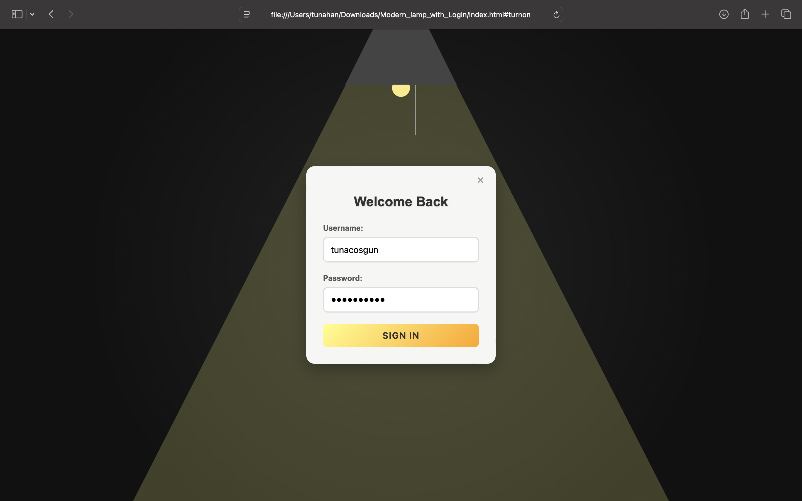

# Modern Lamp Login

🔦 **Modern Lamp Login**, kullanıcıların giriş yapmasını sağlayan şık bir HTML/CSS/JS arayüzüdür. 
Arka planda animasyonlu bir lamba efekti ile tasarlanmış, ışık açıldığında giriş formu ortaya çıkar. 

## ✨ Özellikler
- **CSS ile modern lamba animasyonu** — ışık açıldığında form görünür.
- **Responsive tasarım** — masaüstü ve mobil cihazlarda sorunsuz çalışır.
- **Login formu** — kullanıcı adı ve şifre alanları.
- **Kapatma düğmesi** — formu kolayca kapatabilme.
- **Hover efektleri** ve yumuşak geçişler.

## 🚀 Kullanım
1. Depoyu klonla veya dosyaları indir.
2. `index.html` dosyasını tarayıcıda aç.
3. Lamba ikonuna tıklayarak giriş formunu etkinleştir.

## 📂 Dosya Yapısı
- `index.html` → Ana HTML dosyası
- Dahili `<style>` bloğu → CSS animasyonlar ve stiller
- Dahili `<script>` bloğu → Login kontrolü (dummy alert)

## 📸 Önizleme

## 🛠️ Geliştirme
- Form verilerini backend API’ye bağlayarak gerçek login akışı eklenebilir.
- CSS değişiklikleri ile farklı renk temaları uygulanabilir.

---

👨‍💻 Tasarım & Kodlama: **Tunahan Coşgun**  
🌐 [github.com/tunacosgun](https://github.com/tunacosgun)
